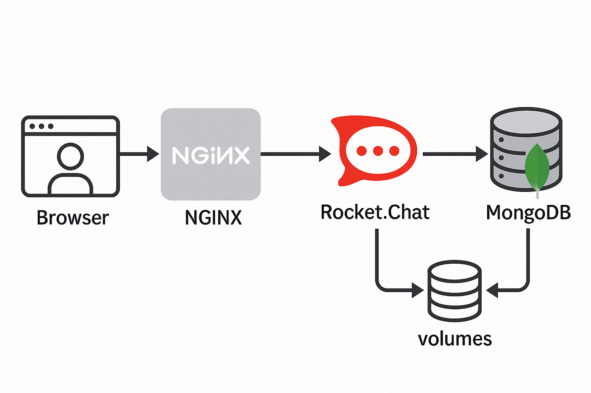

# Guía de inicio rápido: Rocket.Chat + MongoDB (Replica Set) + NGINX

Este README incluye **todos los pasos** necesarios para poner en marcha tu TP de Docker: Rocket.Chat, MongoDB 6 en Replica Set y NGINX como proxy inverso. Sigue cada sección en orden.

## Índice

- [Prerrequisitos](#prerrequisitos)
- [Diagrama de flujo](#diagrama-de-flujo)
- [Estructura de archivos](#estructura-de-archivos)
- [Paso a paso para levantar el entorno](#paso-a-paso-para-levantar-el-entorno)
  - [1. Limpieza total (opcional)](#1-limpieza-total-opcional)
  - [2. Levantar los servicios](#2-levantar-los-servicios)
  - [3. Inicializar el Replica Set de MongoDB](#3-inicializar-el-replica-set-de-mongodb)
  - [4. (Opcional) Verificar Rocket.Chat directo](#4-opcional-verificar-rocketchat-directo)
  - [5. Reiniciar Rocket.Chat y NGINX](#5-reiniciar-rocketchat-y-nginx)
  - [6. Probar vía proxy NGINX](#6-probar-vía-proxy-nginx)
- [Conexión con MongoDB Compass](#conexi%C3%B3n-con-mongodb-compass)
- [Resumen de comandos clave](#resumen-de-comandos-clave)

---

## Prerrequisitos

- Docker y Docker Compose instalados en Windows (con Docker Desktop).
- Puertos **80** y **27017** libres en tu máquina.
- Si utilizas WSL2, asegúrate de que Docker Desktop tenga activa la integración con WSL.

---

## Diagrama de flujo



## Estructura de archivos

```text
TPDockerAYI/
├── docker-compose.yml      
└── nginx/
    └── default.conf       
```

---

## Paso a paso para levantar el entorno

### 1. Limpieza total (opcional)

```bash
# Detiene y elimina contenedores, volúmenes y redes del proyecto
docker compose down -v

# (Opcional) Elimina volúmenes y redes no usados por otros proyectos
docker volume prune -f
docker network prune -f
```

> Garantiza un entorno limpio sin restos de pruebas anteriores.

### 2. Levantar los servicios

```bash
# Desde la carpeta TPDockerAYI
docker compose up -d
```
- Descarga y arranca los contenedores: **mongo:6.0**, **rocket.chat** y **nginx**.
- Verifica que estén activos con:
  ```bash
  docker ps
  ```

### 3. Inicializar el Replica Set de MongoDB

1. Abre otra terminal de PowerShell.
2. Conéctate al contenedor de Mongo:
   ```bash
   docker exec -it tpdockerayi-mongo-1 mongosh
   ```
3. En el prompt `mongosh>`, ejecuta:
   ```js
   rs.initiate({
     _id: "rs0",
     members: [{ _id: 0, host: "mongo:27017" }]
   });
   rs.status();
   ```
4. Asegúrate de que aparezca `stateStr: "PRIMARY"` para `mongo:27017`.
5. Sal de `mongosh` con `exit`.

### 4. (Opcional) Verificar Rocket.Chat directo

```bash
# Debe responder HTTP 200 cuando Rocket.Chat esté listo (puede tardar 1–2 min)
curl -I http://localhost:3000
```

### 5. Reiniciar Rocket.Chat y NGINX

```bash
docker restart tpdockerayi-rocketchat-1 tpdockerayi-nginx-1
```

### 6. Probar vía proxy NGINX

- Abre en tu navegador: [http://localhost](http://localhost)  
  Deberías ver la **interfaz de Rocket.Chat**!

---

## Conexión con MongoDB Compass

Para explorar la base de datos en Windows:

1. Abre **MongoDB Compass**.
2. Crea una nueva conexión y usa esta **URI**:
   ```text
   mongodb://host.docker.internal:27017/?replicaSet=rs0&directConnection=true
   ```
3. Haz clic en **Connect**.
4. Refresca la lista de bases; verás `rocketchat` y sus colecciones (`users`, `rooms`, `messages`, etc.).

> Si no usas WSL2, puedes reemplazar `host.docker.internal` por `127.0.0.1`.

---

## Resumen de comandos clave

```bash
# 1. Limpieza total
docker compose down -v
docker volume prune -f
docker network prune -f

# 2. Levantar servicios
docker compose up -d

# 3. Inicializar Replica Set
docker exec -it tpdockerayi-mongo-1 mongosh
# en mongosh:
rs.initiate({ _id: "rs0", members:[{ _id:0, host:"mongo:27017" }] });
rs.status();
exit

# 4. Ver Rocket.Chat directo
curl -I http://localhost:3000

# 5. Reiniciar frontends
docker restart tpdockerayi-rocketchat-1 tpdockerayi-nginx-1

# 6. Probar proxy
docker compose logs nginx --tail=10
en el navegador: http://localhost

# 7. Conexión Compass
URI: mongodb://host.docker.internal:27017/?replicaSet=rs0&directConnection=true
```

---
