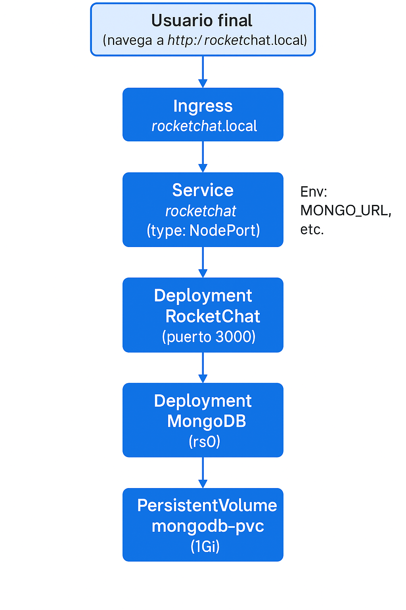
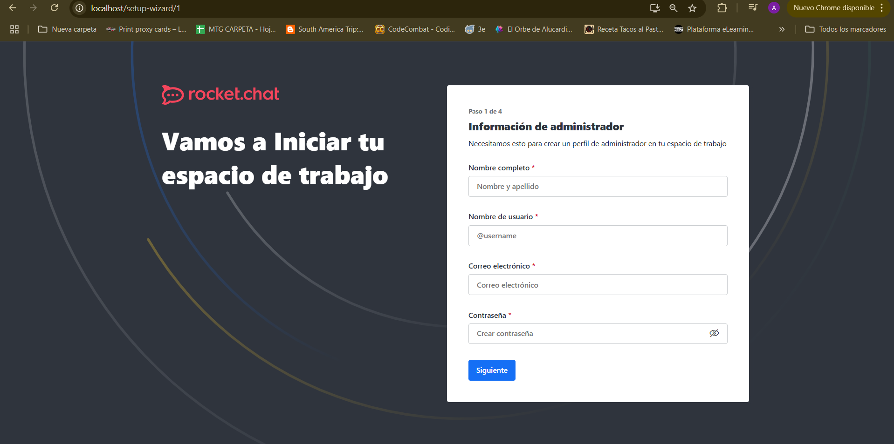
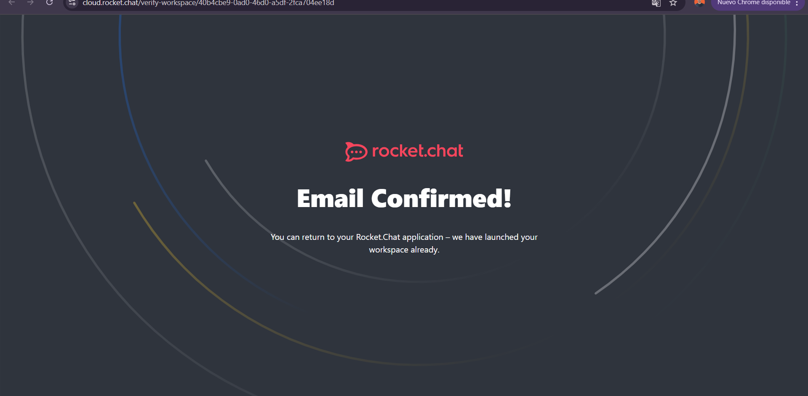
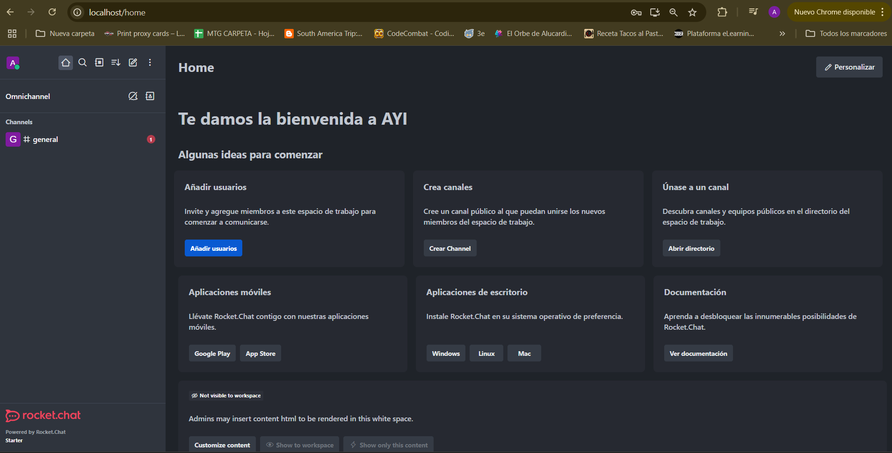
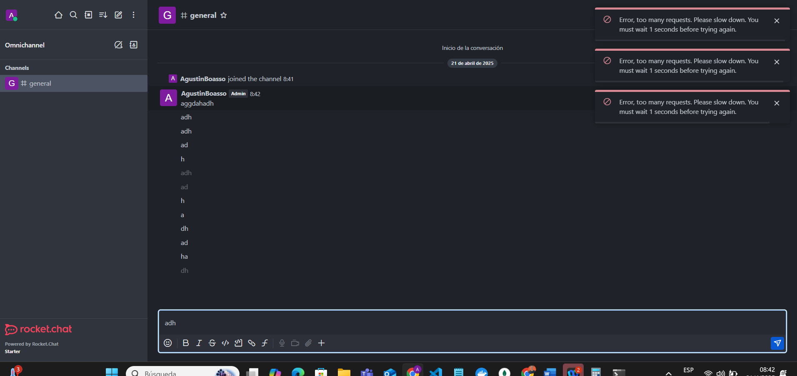
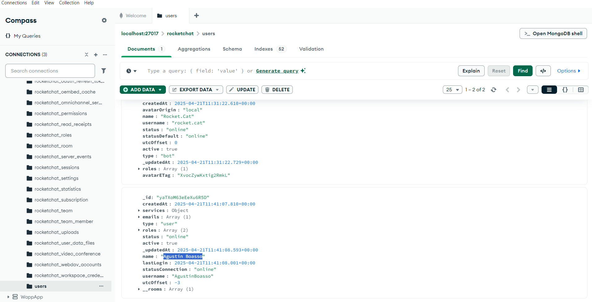

# Guía de Despliegue: Rocket.Chat + MongoDB (Replica Set)

Este README proporciona una guía completa para desplegar Rocket.Chat con MongoDB en modo Replica Set, utilizando dos métodos diferentes:
1. Despliegue con Docker y NGINX como proxy inverso
2. Despliegue en Kubernetes utilizando Minikube

## Índice

- [Prerrequisitos](#prerrequisitos)
- [Opción 1: Despliegue con Docker](#opción-1-despliegue-con-docker)
  - [Diagrama de Arquitectura Docker](#diagrama-de-arquitectura-docker)
  - [Estructura de archivos Docker](#estructura-de-archivos-docker)
  - [Paso a paso: Despliegue con Docker](#paso-a-paso-despliegue-con-docker)
  - [Conexión con MongoDB Compass](#conexión-con-mongodb-compass)
  - [Resumen de comandos Docker](#resumen-de-comandos-docker)
- [Opción 2: Despliegue en Kubernetes](#opción-2-despliegue-en-kubernetes)
  - [Diagrama de Arquitectura Kubernetes](#diagrama-de-arquitectura-kubernetes)
  - [Estructura de archivos Kubernetes](#estructura-de-archivos-kubernetes)
  - [Paso a paso: Despliegue en Kubernetes](#paso-a-paso-despliegue-en-kubernetes)
  - [Componentes de Kubernetes](#componentes-de-kubernetes)
- [Imágenes de la Aplicación](#imágenes-de-la-aplicación)

---

## Prerrequisitos

### Para despliegue con Docker:
- Docker y Docker Compose instalados en Windows (con Docker Desktop)
- Puertos **80** y **27017** libres en tu máquina
- Si utilizas WSL2, asegúrate de que Docker Desktop tenga activa la integración con WSL

### Para despliegue con Kubernetes:
- Minikube instalado y configurado
- kubectl instalado
- Acceso a un registro de contenedores (Docker Hub u otro)
- Permisos de administrador para editar el archivo hosts

---

## Opción 1: Despliegue con Docker

### Diagrama de Arquitectura Docker

Este diagrama muestra la arquitectura de la solución utilizando Docker:


### Estructura de archivos Docker

```text
TPDockerAYI/
├── docker-compose.yml      # Definición de servicios Docker
└── nginx/
    └── default.conf       # Configuración del proxy NGINX
```

### Paso a paso: Despliegue con Docker

#### 1. Limpieza total (opcional)

```bash
# Detiene y elimina contenedores, volúmenes y redes del proyecto
docker compose down -v

# (Opcional) Elimina volúmenes y redes no usados por otros proyectos
docker volume prune -f
docker network prune -f
```

> Garantiza un entorno limpio sin restos de pruebas anteriores.

#### 2. Levantar los servicios

```bash
# Desde la carpeta TPDockerAYI
docker compose up -d
```
- Descarga y arranca los contenedores: **mongo:6.0**, **rocket.chat** y **nginx**
- Verifica que estén activos con:
  ```bash
  docker ps
  ```

#### 3. Inicializar el Replica Set de MongoDB

1. Abre otra terminal de PowerShell
2. Conéctate al contenedor de Mongo:
   ```bash
   docker exec -it tpdockerayi-mongo-1 mongosh
   ```
3. En el prompt `mongosh>`, ejecuta:
   ```js
   rs.initiate({
     _id: "rs0",
     members: [{ _id: 0, host: "mongo:27017" }]
   });
   rs.status();
   ```
4. Asegúrate de que aparezca `stateStr: "PRIMARY"` para `mongo:27017`
5. Sal de `mongosh` con `exit`

#### 4. (Opcional) Verificar Rocket.Chat directo

```bash
# Debe responder HTTP 200 cuando Rocket.Chat esté listo (puede tardar 1–2 min)
curl -I http://localhost:3000
```

#### 5. Reiniciar Rocket.Chat y NGINX

```bash
docker restart tpdockerayi-rocketchat-1 tpdockerayi-nginx-1
```

#### 6. Probar vía proxy NGINX

- Abre en tu navegador: [http://localhost](http://localhost)  
  Deberías ver la **interfaz de Rocket.Chat**!

### Conexión con MongoDB Compass

Para explorar la base de datos en Windows:

1. Abre **MongoDB Compass**
2. Crea una nueva conexión y usa esta **URI**:
   ```text
   mongodb://host.docker.internal:27017/?replicaSet=rs0&directConnection=true

   o

   mongodb://localhost:27017/?replicaSet=rs0&directConnection=true
   ```
3. Haz clic en **Connect**
4. Refresca la lista de bases; verás `rocketchat` y sus colecciones (`users`, `rooms`, `messages`, etc.)

> Si no usas WSL2, puedes reemplazar `host.docker.internal` por `127.0.0.1`

### Resumen de comandos Docker

```bash
# 1. Limpieza total
docker compose down -v
docker volume prune -f
docker network prune -f

# 2. Levantar servicios
docker compose up -d

# 3. Inicializar Replica Set
docker exec -it tpdockerayi-mongo-1 mongosh
# en mongosh:
rs.initiate({ _id: "rs0", members:[{ _id:0, host:"mongo:27017" }] });
rs.status();
exit

# 4. Ver Rocket.Chat directo
curl -I http://localhost:3000

# 5. Reiniciar frontends
docker restart tpdockerayi-rocketchat-1 tpdockerayi-nginx-1

# 6. Probar proxy
docker compose logs nginx --tail=10
en el navegador: http://localhost

# 7. Conexión Compass
URI: mongodb://host.docker.internal:27017/?replicaSet=rs0&directConnection=true
```

---

## Opción 2: Despliegue en Kubernetes

### Diagrama de Arquitectura Kubernetes

Este diagrama muestra la arquitectura de la solución utilizando Kubernetes:



### Estructura de archivos Kubernetes

```text
TPDockerAYI/
├── kubernetes/
    ├── mongo.yaml        # Configuración de MongoDB (PVC, Deployment, Service)
    └── rocketchat.yaml   # Configuración de Rocket.Chat (Deployment, Service, Ingress)
```

### Componentes de Kubernetes

#### MongoDB en Kubernetes
- **PersistentVolumeClaim (PVC)**: Proporciona almacenamiento persistente para la base de datos
- **Deployment**: Gestiona el pod de MongoDB con configuración de Replica Set
- **Service**: Expone MongoDB internamente para Rocket.Chat

#### Rocket.Chat en Kubernetes
- **Deployment**: Gestiona los pods de Rocket.Chat
- **Service**: Expone Rocket.Chat internamente
- **Ingress**: Proporciona acceso externo a través de un nombre de dominio

### Paso a paso: Despliegue en Kubernetes

1. Iniciar Minikube  
   ```bash
   minikube start
   ```
   > Esto inicia un cluster local de Kubernetes

2. Aplicar la configuración de MongoDB:
   ```bash
   kubectl apply -f mongo.yaml
   ```
   > Crea el PVC, Deployment y Service para MongoDB

3. Inicializar el replica set en MongoDB:
   ```bash
   kubectl exec -it deploy/mongodb -- mongo
   ```
   > Conecta con el pod de MongoDB

4. Dentro del shell de mongo:
   ```js
   rs.initiate()
   ```
   > Configura el Replica Set de MongoDB

5. Aplicar la configuración de Rocket.Chat:
   ```bash
   kubectl apply -f rocketchat.yaml
   ```
   > Despliega Rocket.Chat y configura el acceso

6. Configurar acceso local:
   ```lua
   127.0.0.1 rocketchat.local
   ```
   > Agregar al archivo /etc/hosts (Windows: C:\\Windows\\System32\\drivers\\etc\\hosts)

7. Acceder a la aplicación:
   - Abre http://rocketchat.local en tu navegador
   - La primera vez, configura el usuario administrador

---

## Imágenes de la Aplicación






